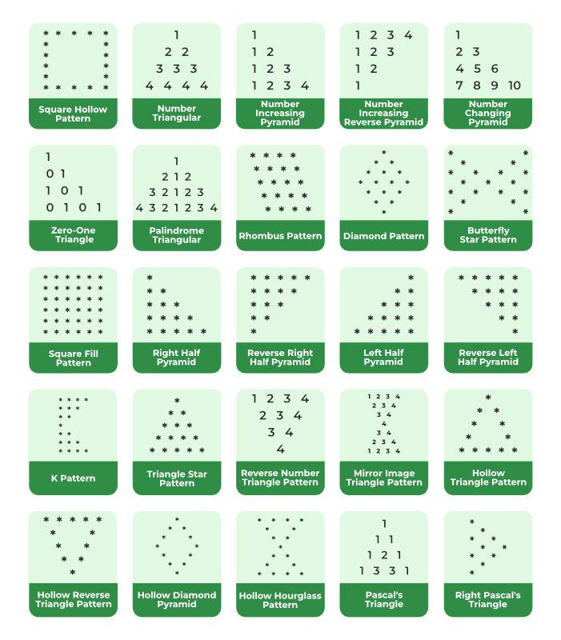

# Java Pattern Programs
Here, you will find the top 25 Java pattern programs with their proper code and explanation. 

1. Square Hollow Pattern
2. Number triangle Pattern
3. Number-increasing Pyramid Pattern
4. Number-increasing reverse Pyramid Pattern
5. Number-changing Pyramid Pattern
6. Zero-One Triangle Pattern
7. Palindrome Triangle Pattern
8. Rhombus Pattern
9. Diamond Star Pattern
10. Butterfly Star Pattern
11. Square Fill Pattern
12. Right Half Pyramid Pattern
13. Reverse Right Half Pyramid Pattern
14. Left Half Pyramid Pattern
15. Reverse Left Half Pyramid Pattern 
16. K Pattern
17. Triangle Star Pattern
18. Reverse number Triangle Pattern
19. Mirror Image Triangle Pattern 
20. Hollow Triangle Pattern 
21. Hollow Reverse Triangle Pattern 
22. Hollow Diamond Pyramid 
23. Hollow Hourglass Pattern 
24. Pascal’s Triangle 
25. Right Pascal’s Triangle
